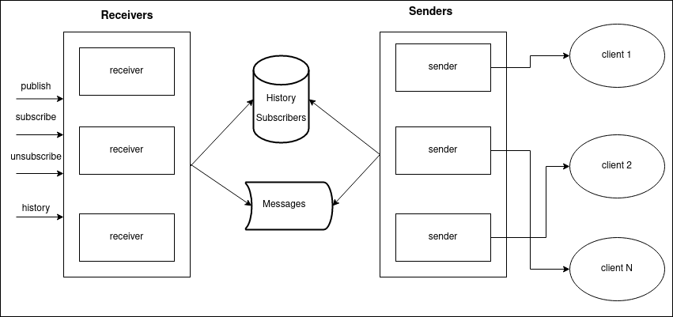

# Scalable message publisher

#### To start the service:

`sudo docker run --name redis -p 6379:6379 -d redis
`

`sbt receiver/run
`

`sbt sender/run`

### Overview



This is demo of horizontally scalable message delivery/publishing system.

Every receiver exposes graphql api:
```
type Mutation {
    publish(msg: String!): Boolean!
    subscribe(addr: String!): Boolean!
    unsubscribe(addr: String!): Boolean!
}

type Queries {
    history(from: Int!, to: Int!): [String!]!
}
```

Receivers save messages to queue (based on redis list, but could be ant other event queue) 
senders read data from the queue and delivers it to the client.

This is not production ready for sure, there are some obvious improvements to be made:
* Use proper types for users, messages, urls etc.
* Do not pull subscribers every time new message has arrived, each sender service should pull active subscribers ones 
  and after that receiver services should send subscribe/unsubscribe events in fan-out way to senders.
* Using different effects for resources acquiring and processing.
* Better error handling.
* Proper integration testing(probably with test containers to start clients as well).
* Send health checks to clients.


